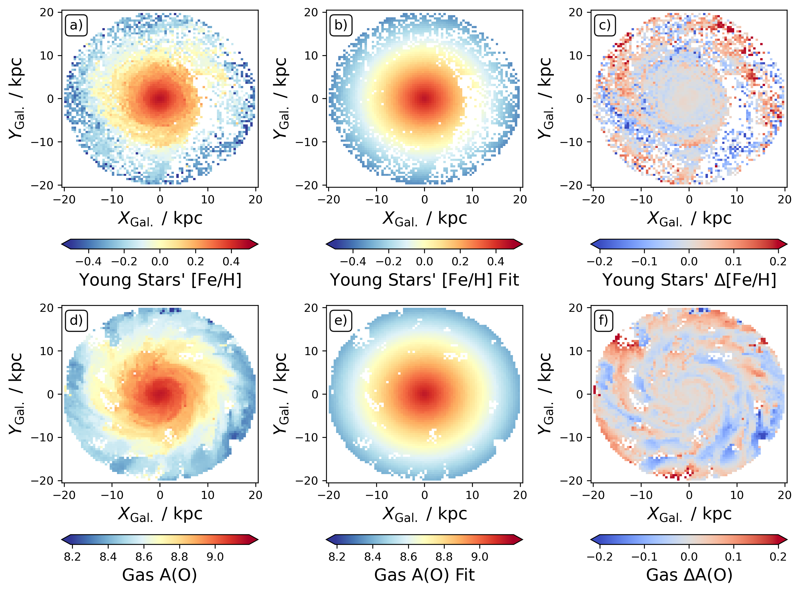

# Local variations of the radial metallicity gradient in a simulated NIHAO-UHD Milky Way analogue and their implications for (extra-)galactic studies (Buder et al., 2024)

## Authors

Sven Buder (ANU & ASTRO 3D, sven.buder@anu.edu.au), Tobias Buck (IWR, ITA), Qian-Hui Chen (ANU & ASTRO 3D), and Kathryn Grasha (ANU & ASTRO 3D)

## Abstract

Radial metallicity gradients are fundamental to understanding galaxy formation and evolution.
In our high-resolution simulation of a NIHAO-UHD Milky Way analogue, we analyze the linearity, scatter, spatial coherence, and age-related variations of metallicity gradients using young stars and gas.
While a global linear model generally captures the gradient, it ever so slightly overestimates metallicity in the inner galaxy and underestimates it in the outer regions of our simulated galaxy. Both a quadratic model, showing an initially steeper gradient that smoothly flattens outward, and a piecewise linear model with a break radius at 10 kpc (2.5 effective radii) fit the data equally better. The spread of [Fe/H] of young stars in the simulation increases by a tenfold from the innermost to the outer galaxy at a radius of 20 kpc. We find that stars born at similar times along radial spirals drive this spread in the outer galaxy, with a chemical under- and over-enhancement of up to 0.1 dex at leading and trailing regions of such spirals, respectively.
This localised chemical variance highlights the need to examine radial and azimuthal selection effects for both Galactic and extragalactic observational studies. The arguably idealised but volume-complete simulations suggest that future studies should not only test linear and piecewise linear gradients, but also non-linear functions such as quadratic ones to test for a smooth gradient rather than one with a break radius. Either finding would help to determine the importance of different enrichment or mixing pathways and thus our understanding of galaxy formation and evolution scenarios.



## How to Cite

Please cite this work as follows:

```bibtex
@article{Buder2024c,
    author = {{Buder}, Sven and {Buck}, Tobias and {Chen}, Qian-Hui and {Grasha}, Kathryn},
    title = {Local variations of the radial metallicity gradient in a simulated NIHAO-UHD Milky Way analogue and their implications for (extra-)galactic studies},
    journal = {arXiv e-prints},
    volume = {abs/2412.01157},
    month = dec,
    pages = {arXiv:2412.01157},
    year = {2024},
    archivePrefix = {arXiv},
    eprint = {2412.01157},
    keywords = {Galaxy: structure -- Galaxy: abundances  -- galaxies: structure -- galaxies: abundances},
    doi = {10.48550/arXiv.2412.01157},
    primaryClass = {astro-ph.GA},
    adsurl = {https://ui.adsabs.harvard.edu/abs/2024arXiv241201157B}
}
```
